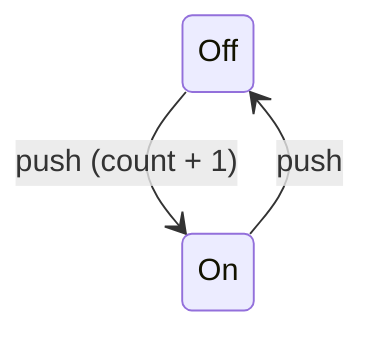

# Push Button

Pushbutton example for `eparch/state_machine`.



Modelled after the canonical `gen_statem` pushbutton from the OTP docs.

- Each call to `push` toggles the button between `Off` and `On`.
- Only `Off -> On` transitions increment the press counter.
- `get_count` queries the current count without changing state.

## Usage

```gleam
import pushbutton

pub fn main() {
  let assert Ok(machine) = pushbutton.start()

  pushbutton.get_count(machine.data)  // => 0
  pushbutton.push(machine.data)       // => 0 (count before increment)
  pushbutton.get_count(machine.data)  // => 1
  pushbutton.push(machine.data)       // => 1 (On -> Off, no increment)
  pushbutton.get_count(machine.data)  // => 1
}
```
