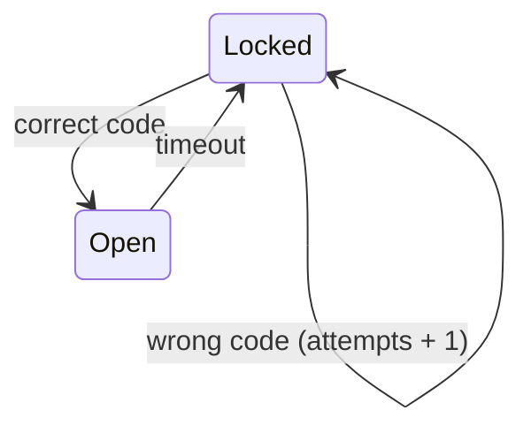

# Door Lock

Door Lock example for the `eparch/state_machine`.



Demonstrates:
- `with_state_enter()` to trigger an action on entering a state
- `StateTimeout` to auto-lock after a configurable delay
- Synchronous replies using embedded `Subject` in messages

## Usage

```gleam
import doorlock

pub fn main() {
  let assert Ok(machine) = doorlock.start("1234")
  let subject = machine.data

  doorlock.get_status(subject)   // => Locked
  doorlock.enter_code(subject, "0000")  // => Error("Wrong code")
  doorlock.enter_code(subject, "1234")  // => Ok(Nil)
  doorlock.get_status(subject)   // => Open
  // After 5 seconds the door auto-locks back to Locked
}
```

