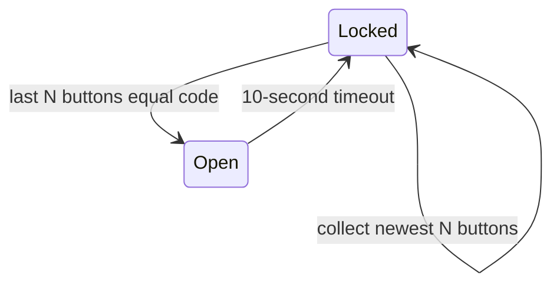

# Door Lock

Door Lock example for `eparch/state_machine`, based on the [OTP Door Lock example](https://www.erlang.org/doc/system/statem.html#example).



The machine keeps a rolling window containing at most the last N keypad digits, where N is the configured code length. Entering `Locked` prints `Lock` and clears that window. Entering `Open` prints `Unlock` and starts the configurable state timeout. Buttons pressed while open are ignored and do not restart it.

The default auto-lock delay is 10 seconds. `start_with_lock_timeout` permits a different delay, primarily for integration tests. An empty code is accepted but can never open the lock.

## Usage

```gleam
import doorlock

pub fn main() {
  let assert Ok(machine) = doorlock.start([1, 2, 3, 4])

  doorlock.get_status(machine.ref) // Locked
  doorlock.enter_code(machine.ref, [0, 0, 0, 0]) // returns Nil asynchronously
  doorlock.enter_code(machine.ref, [1, 2, 3, 4]) // returns Nil asynchronously
  doorlock.get_status(machine.ref) // Open
  // After 10 seconds the door auto-locks back to Locked.
}
```
