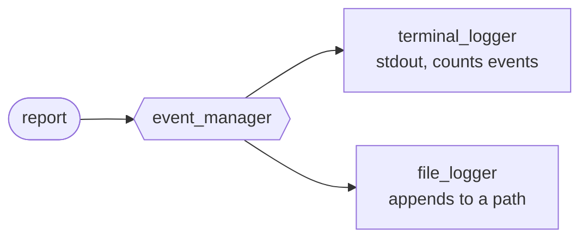

# Terminal Logger

`gen_event` example for `eparch/event_manager`. Modelled after the
canonical [`error_man` example from the OTP docs](https://www.erlang.org/doc/system/events.html).



A single event manager fans every `Reported(message)` event out to
**every** registered handler. Handlers are added and removed at runtime,
and each carries its own private state.

Demonstrates:

- Starting a manager with `event_manager.start_link`
- Registering handlers with `add_handler` and `new_handler`
- Per-handler state and `Continue` returns from `on_event`
- `on_terminate` cleanup callback
- Broadcasting events with `notify`

## Usage

An event manager hosts any number of independent **handlers**. Every
handler receives every event that is broadcast via `notify` /
`sync_notify`. This module exposes a tiny `error_man`-style bus with
two handler flavours:

- `add_terminal_logger`: prints each event to stdout and keeps a running count.
- `add_file_logger`: appends each event to a file.

```gleam
import terminal_logger

pub fn main() {
  let assert Ok(manager) = terminal_logger.start()

  let assert Ok(_term_ref) = terminal_logger.add_terminal_logger(manager)
  let assert Ok(_file_ref) =
    terminal_logger.add_file_logger(manager, "errors.txt")

  terminal_logger.report(manager, "no_reply")
  // stdout:       ***Error*** no_reply
  // errors.txt:   ***Error*** no_reply

  terminal_logger.stop(manager)
}
```
